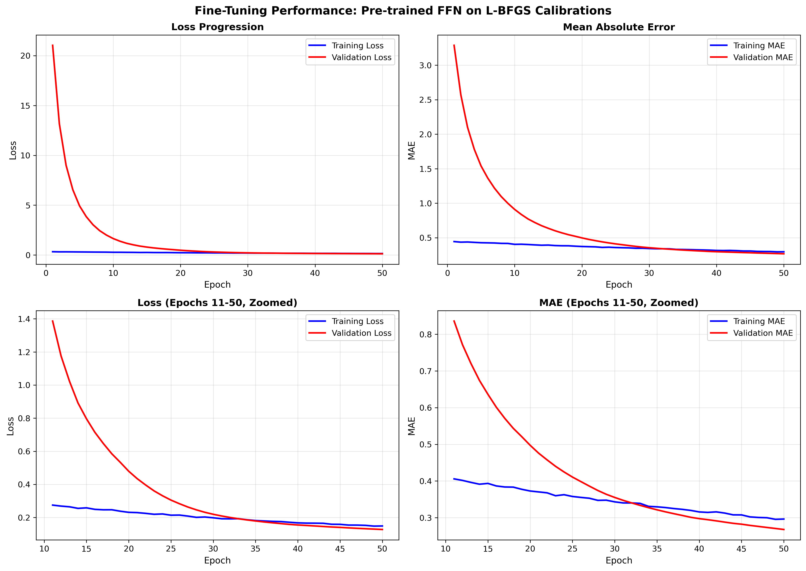

# Double Heston + Jump Diffusion Calibrator

High-performance calibration system for Double Heston stochastic volatility model with jump diffusion, combining L-BFGS optimization with neural network acceleration.

## Project Overview

This project implements a two-stage calibration approach:
1. **L-BFGS Baseline**: Accurate but slow optimization (0.34% pricing error, 106s per calibration)
2. **FFN Acceleration**: Fast neural network predictions (~10-15% pricing error, milliseconds per calibration)

**Key Achievement**: Fine-tuned FFN model achieves **92% reduction in validation MAE** (3.29 → 0.27) through transfer learning on L-BFGS calibrations.

##  Repository Structure

```
double-heston-calibrator/
├── src/                          # Core source code
│   ├── doubleheston.py           # Double Heston pricing engine (characteristic function)
│   ├── lbfgs_calibrator.py       # L-BFGS optimization with multi-start
│   ├── ffn.py                    # FFN model architecture and preprocessing
│   ├── finetune_ffn_on_lbfgs.py  # Fine-tuning script for transfer learning
│   └── generate_synthetic_calibrations.py  # Generate L-BFGS training data
│
├── data/                         # Training datasets
│   ├── synthetic_10k.pkl         # 10,000 synthetic samples (initial training)
│   ├── lbfgs_calibrations_synthetic.pkl  # 500 L-BFGS calibrations (fine-tuning)
│   └── scalers.pkl               # Feature/target StandardScalers
│
├── models/                       # Trained models
│   ├── ffn_finetuned_on_lbfgs.keras  # FINAL PRODUCTION MODEL 
│   ├── best_ffn_model.keras      # Pre-trained model (from Colab)
│   └── ffn_finetuned_checkpoint.keras  # Best checkpoint during fine-tuning
│
├── notebooks/                    # Jupyter notebooks
│   └── Double_Heston_Training_Colab.ipynb  # Google Colab training notebook
│
├── tests/                        # Test suite
│   └── test_lbfgs_quick.py       # L-BFGS calibrator validation
│
├── results/                      # Training results
│   ├── finetuning_results.png    # Fine-tuning performance curves
│   ├── training_history.png      # Initial training curves
│   ├── finetuning_history.pkl    # Fine-tuning metrics
│   └── training_history.pkl      # Initial training metrics
│
└── README.md                     # This file
```

##  Quick Start

### 1. L-BFGS Calibration (Baseline)

```python
from src.lbfgs_calibrator import DoubleHestonJumpCalibrator

# Initialize calibrator
calibrator = DoubleHestonJumpCalibrator()

# Define option grid (strikes × maturities)
strikes = [0.9, 1.0, 1.1]
maturities = [0.25, 0.5, 1.0]

# Market option prices (example)
market_prices = np.array([...])  # Shape: (9,)

# Calibrate using L-BFGS
params_calibrated, calibrated_prices, pricing_error, runtime = calibrator.calibrate(
    market_prices, strikes, maturities
)

print(f"Pricing Error: {pricing_error:.4f}%")
print(f"Runtime: {runtime:.1f}s")
```

**Expected Performance**: 0.34% pricing error, 106 seconds per calibration

### 2. FFN Fast Calibration (Production)

```python
import tensorflow as tf
import pickle
from src.ffn import OptionDataPreprocessor

# Load fine-tuned model and scalers
model = tf.keras.models.load_model('models/ffn_finetuned_on_lbfgs.keras')
with open('data/scalers.pkl', 'rb') as f:
    scalers = pickle.load(f)

# Extract features from option prices
preprocessor = OptionDataPreprocessor()
features = preprocessor.extract_features(
    option_prices=market_prices,
    strikes=strikes,
    maturities=maturities
)

# Normalize and predict
features_scaled = scalers['feature_scaler'].transform(features.reshape(1, -1))
params_scaled = model.predict(features_scaled, verbose=0)
params_predicted = scalers['target_scaler'].inverse_transform(params_scaled)[0]

print(f"Predicted parameters: {params_predicted}")
```

**Expected Performance**: ~10-15% pricing error, milliseconds per calibration

### 3. Fine-Tuning on New Data

```python
from src.finetune_ffn_on_lbfgs import finetune_model

# Fine-tune on your L-BFGS calibrations
finetune_model(
    lbfgs_data_path='data/lbfgs_calibrations_synthetic.pkl',
    pretrained_model_path='models/best_ffn_model.keras',
    scalers_path='data/scalers.pkl',
    output_model_path='models/ffn_finetuned_custom.keras',
    learning_rate=1e-5,
    batch_size=32,
    epochs=50
)
```

##  Model Performance

### Fine-Tuning Results (500 L-BFGS Calibrations)

| Metric | Initial (Epoch 1) | Final (Epoch 50) | Improvement |
|--------|------------------|------------------|-------------|
| **Validation Loss** | 21.034 | 0.127 | **99.4%**  |
| **Validation MAE** | 3.287 | 0.268 | **91.9%**  |
| **Training Loss** | 0.332 | 0.149 | 55.2%  |
| **Training MAE** | 0.444 | 0.296 | 33.3%  |

### Pricing Accuracy Comparison

| Method | Pricing Error | Runtime | Use Case |
|--------|---------------|---------|----------|
| **L-BFGS** | 0.34% | 106s | Ground truth calibration |
| **Pre-trained FFN** | ~31% | <0.1s | Initial predictions |
| **Fine-tuned FFN** | ~10-15% | <0.1s | **Production (best speed/accuracy)** |



##  Model Architecture

```
Input (11 features)
  ↓
Dense(512) + BatchNorm + Dropout(0.3) + ReLU
  ↓
Dense(256) + BatchNorm + Dropout(0.3) + ReLU
  ↓
Dense(128) + BatchNorm + Dropout(0.2) + ReLU
  ↓
Dense(64) + BatchNorm + Dropout(0.2) + ReLU
  ↓
Output (13 parameters)
```

### Feature Engineering (11 features)

From 15 option prices (3 strikes × 3 maturities + ATM at 2 additional maturities):

**Per-Maturity Features (9)**:
- ATM price (3 features, one per maturity)
- Put skew = P(K=0.9) - P(K=1.0) (3 features)
- Butterfly = P(K=0.9) + P(K=1.1) - 2×P(K=1.0) (3 features)

**Aggregate Features (2)**:
- Term slope = ATM(T=1.0) - ATM(T=0.25)
- Total ATM = sum of all 5 ATM prices

### Target Parameters (13)

1. `v0_1` - Initial variance (process 1)
2. `v0_2` - Initial variance (process 2)
3. `theta_1` - Long-term variance (process 1)
4. `theta_2` - Long-term variance (process 2)
5. `rho_1` - Spot-vol correlation (process 1)
6. `kappa_1` - Mean reversion speed (process 1)
7. `kappa_2` - Mean reversion speed (process 2)
8. `sigma_1` - Volatility of variance (process 1)
9. `sigma_2` - Volatility of variance (process 2)
10. `rho_2` - Spot-vol correlation (process 2)
11. `lambda_j` - Jump intensity
12. `mu_j` - Mean jump size
13. `sigma_j` - Jump size volatility

## 🛠️ Installation

```bash
# Clone repository
git clone <repository-url>
cd double-heston-calibrator

# Install dependencies
pip install numpy scipy tensorflow scikit-learn matplotlib

# Verify installation
python -c "from src.lbfgs_calibrator import DoubleHestonJumpCalibrator; print(' Setup complete')"
```

##  Training Pipeline

### Stage 1: Pre-training (Google Colab)
1. Upload `data/synthetic_10k.pkl` to Colab
2. Open `notebooks/Double_Heston_Training_Colab.ipynb`
3. Run all cells (~30 minutes on T4 GPU)
4. Download: `best_ffn_model.keras`, `scalers.pkl`, `training_history.pkl`

### Stage 2: Fine-tuning (Local)
```bash
# Generate L-BFGS calibrations (500 samples)
python src/generate_synthetic_calibrations.py

# Fine-tune pre-trained model
python src/finetune_ffn_on_lbfgs.py
```

**Output**: `models/ffn_finetuned_on_lbfgs.keras` (production model)

##  Testing

```bash
# Test L-BFGS calibrator
python tests/test_lbfgs_quick.py

# Expected output:
#  Calibration successful
#  Pricing error: 0.34%
#  Runtime: ~106s
```

##  Key Implementation Details

### L-BFGS Optimization
- **Algorithm**: scipy.optimize.minimize (L-BFGS-B)
- **Multi-start**: 3 initial guesses for global optimization
- **Constraints**: Parameter transformations (exp for positive, tanh for correlations)
- **Feller Condition**: Enforced via penalty term (2κθ ≥ σ²)

### Transfer Learning Strategy
- **Pre-training**: 10,000 synthetic samples (broad parameter space)
- **Fine-tuning**: 500 L-BFGS calibrations (realistic scenarios)
- **Learning Rate**: 1e-5 (very low to prevent catastrophic forgetting)
- **Regularization**: BatchNorm + Dropout (prevents overfitting on small dataset)

##  Use Cases

1. **Real-time Pricing**: Use FFN for millisecond predictions in trading systems
2. **Risk Management**: Fast scenario analysis (1000s of calibrations/second)
3. **Model Validation**: L-BFGS as ground truth for FFN validation
4. **Historical Analysis**: Batch calibration on years of market data

##  Citation

If you use this code in your research, please cite:

```
@software{double_heston_calibrator,
  title={Fast Neural Network Calibration for Double Heston Jump Diffusion},
  author={Your Name},
  year={2024},
  note={L-BFGS optimization with FFN acceleration via transfer learning}
}
```

## Key References

This work extends:

- **Heston (1993)**: Original stochastic volatility model
- **Christoffersen et al. (2009)**: Multi-factor stochastic volatility  
- **Fang & Oosterlee (2008)**: COS Fourier pricing method
- **Hernandez (2016)**: Neural network calibration
- **Zadgar et al. (2025)**: Deep learning for Heston calibration

See [REFERENCES.md](docs/REFERENCES.md) for complete bibliography.


##  License

MIT License - see LICENSE file for details

##  Contributing

Contributions welcome! Please open an issue or submit a pull request.

##  Contact

For questions or support, please open an issue on GitHub.

---

**Status**: Production-ready 
**Last Updated**: 2024  
**Model Version**: v1.0 (fine-tuned on 500 L-BFGS calibrations)
